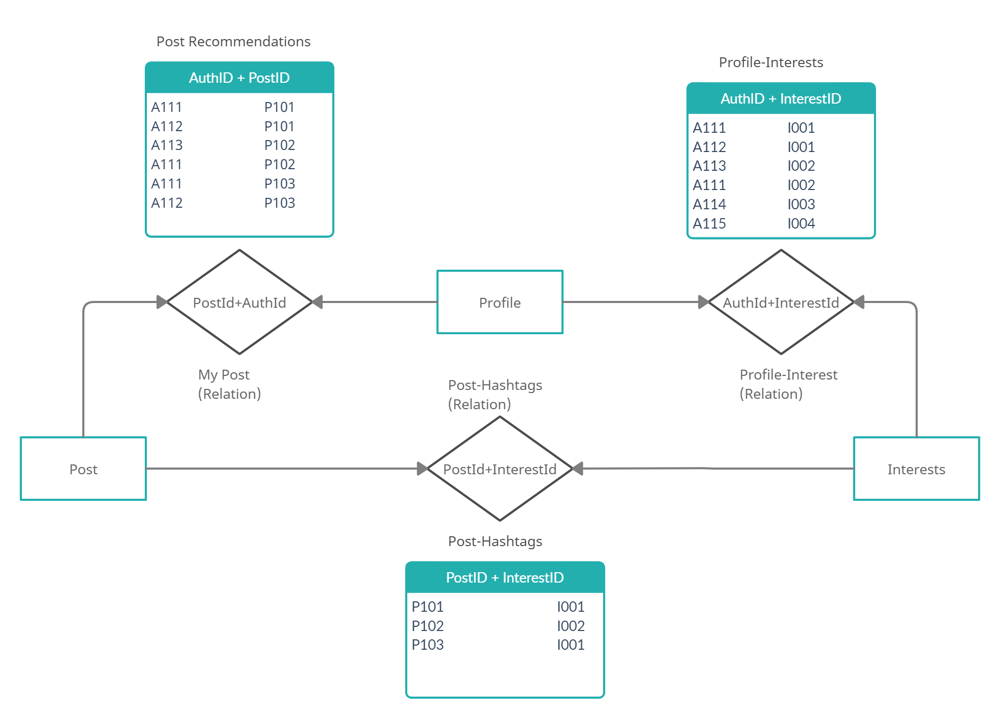

# Post Recommendations
## Overview
---

### Regarding the algorithm behind how post recommendation works
___
## Tables:

## Description:
In the table Profile-interests, the interests of each author are collected at the time of registration.
Our Main Agenda here is to recommend the posts to the user based on their interests via Hashtags(InterestID) used in the post.
* Whenever there is a post regarding some hashtags, it will be reflected in the Post-Hashtags table with its corresponding PostID and the InterestID used in it.
* When a tuple gets added in the Post-Hashtags Table, using Profile-Interest Table, we collect the AuthID and PostID and it gets reflected in the Post-Recommendation table.
* Basically, using the Post-Hashtags table, we are fetching the AuthID who are related to any hashtags in that post from the Profile-Interest table.

## E-R model:

